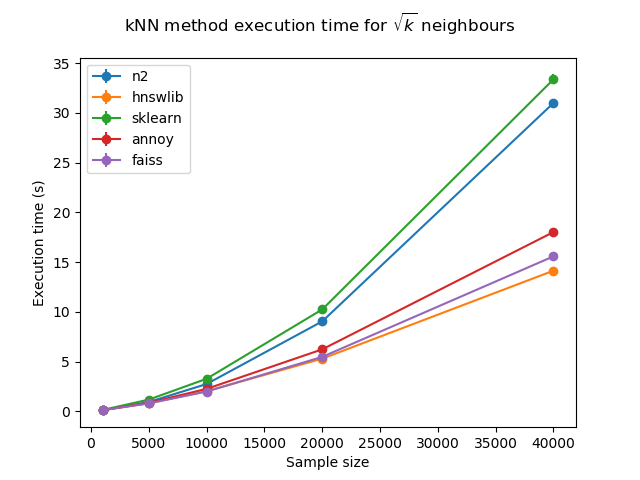

# Benchmarking nearest neighbour libraries
Searching for nearest neighbours in high dimensional spaces is an important problem, and there no one silver bullet approach for every task.
This repository contains benchmarks of several Python libraries, and its goal is to compare various existing implementations of nearest neighbour search and select one that is most suited to our problem space.

There are several other benchmarking suites for comparing nearest neighbour search implementations on the Internet, most comprehensive being [Erik Bernhardsson's repository](https://github.com/erikbern/ann-benchmarks), but most of those test for slightly different usecases.

# Evaluated libraries
 - [Annoy](https://github.com/spotify/annoy) - Python bindings for C++ library from Spotify. It uses random projection to build up a tree and split it to get a forest of trees for fast querying.
 - [hnswlib](https://github.com/nmslib/hnsw) - Part of [nmslib](https://github.com/nmslib/nmslib) project. Header-only implementation of [HNSW algorithm](https://arxiv.org/abs/1603.09320).
 - [faiss](https://github.com/facebookresearch/faiss) - a library for efficient similarity search and clustering of dense vectors from Facebook AI Research implementing several [different](https://arxiv.org/abs/1609.01882) [algorithms](https://arxiv.org/abs/1804.09996). Includes [GPU implementation](https://arxiv.org/abs/1702.08734) (not tested here).
 - [scikit-learn](http://scikit-learn.org/stable/modules/neighbors.html) - a machine learning library designed to interoperate with NumPy and SciPy and providing implementations of many different algorithms. 
 - [n2](https://github.com/kakao/n2) - a library implementing HNSW algoritm with focus on optimizing index build times for large datasets.

# Context
We are benchmarking nearest neighbour methods as the part of a following problem - consider an error log for a distributed computing cluster. Those logs can regularly reach tens or even hundreds of thousands of entries, which makes human analysis of the logs pretty infeasible. We are using nearest neighbour search as a part of an algorithm for clusterising those logs to identify common problems and anomalous errors which may give us the ability to correct those problems and predict future difficulties.

The main difference between our usage of those algorithms and the case most of them were optimized for arises due to a fact that in a lot of problems using nearest neighbour search you are presumed to build an index once and query it many times, using different data points. In our case, however, query set is the same as training set. Moreover, we query the index exactly once for every point in initial dataset.

# Dataset

A file with error logs from ATLAS experimant at CERN is used for those benchmarks. For each launch we choose a random sample of logs and use it for every algorithm. We use different neighbour numbers, both constant for different sample sizes and scaling with those (as square root of number of samples). Full results can be seen in [img](https://github.com/DVGrin/kNN_benchmarks/tree/master/img) folder of that repository.

Word2Vec algorithm is used to convert strings of errors into vectors which are then used for nearest neighbour searching. Note that due to a nature of a problem we have to find nearest neighbours for every point in the dataset, we don't have the distinction between the train dataset and test dataset.

# Results

As choice of optimal *k* value depends on the dataset, we used both static values, as well as scaling as a square root on *n* values of *k* in our benchmark. This choice did not meaningfully change relative efficiency of tested algorithms.

As we can see for now, hnswlib should be the best choice for us from the tested libraries, winning pretty consistently on every dataset size.
